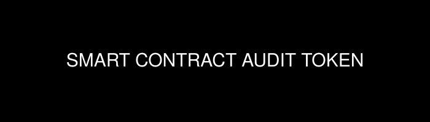

## Introduction

## Project setup
```
yarn install
```

### Compiles and hot-reloads for development
```
yarn serve
```

### Compiles and minifies for production
```
yarn build
```

### Lints and fixes files
```
yarn lint
```

### Customize configuration
See [Configuration Reference](https://cli.vuejs.org/config/).

#### Platforms
- [x] Windows 7,8,10
- [x] Linux
- [x] macOS
- [ ] iOS
- [ ] android

### Security Features
- [x] localhost-free
- [x] custom protocol for secure mode
- [x] Dynamic ahead of Time Compilation with functional tree-shaking
- [x] functional Address Space Layout Randomization
- [x] OTP salting of function names and messages at runtime
- [x] CSP Injection

#### Notes

## Development

### Operating systems

### Documentation

## Licenses
Code: (c) 2021 - 2021 - Smart Contract Audit Token.

MIT or MIT/Apache 2.0 where applicable.

